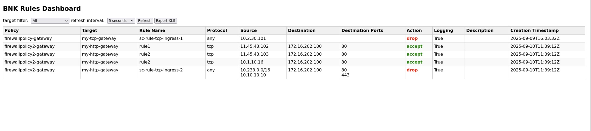
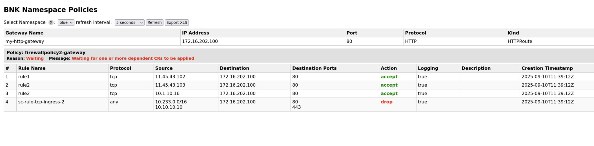

# BNKboard

**Bnkboard** is a web application with a **frontend + FastAPI backend + Nginx** architecture, ready to run using **Docker Compose**. 
It uses k8s API to visualize the F5 BNK Firewall policies applied to the Gateway CRD.
It's made just for demonstration purposes.

---

## 🛠️ Requirements

- Docker
- Docker Compose  

---

## 🚀 Quick Start

Clone the repository:

bash
git clone https://github.com/pdiliberto/bnkboard.git

cd bnkboard

Backend needs to run kubectl. Edit the docker-compose.yaml to include your .kube/config file:

volumes:
      - ~/.kube/config:/root/.kube/config:ro
      
docker compose up --build -d

---

bnkdash frontend listens on port 8080

http://<IP ADDR>:8080 for a list of all FW policies installed

http://<IP ADDR>:8080/namespace to select a specific namespace (only namespaces with a gateway will be listed) and show the associated policy

