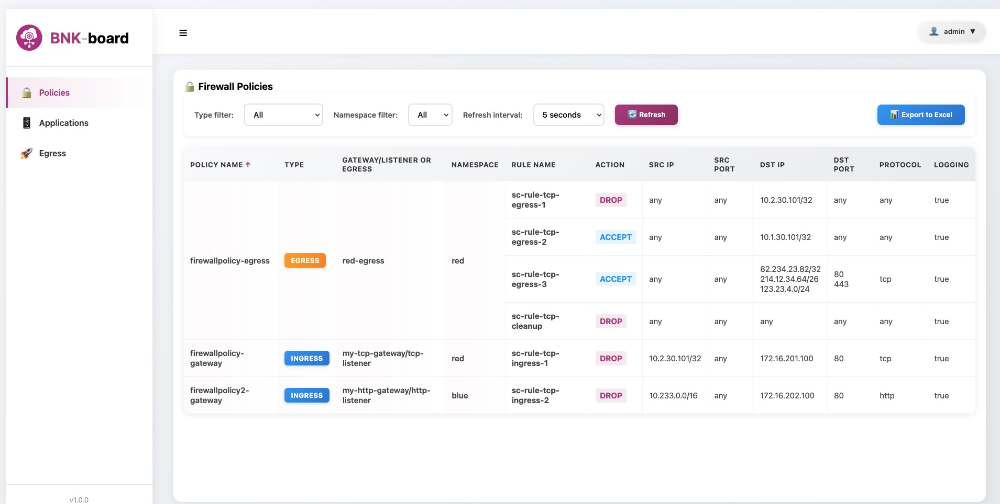
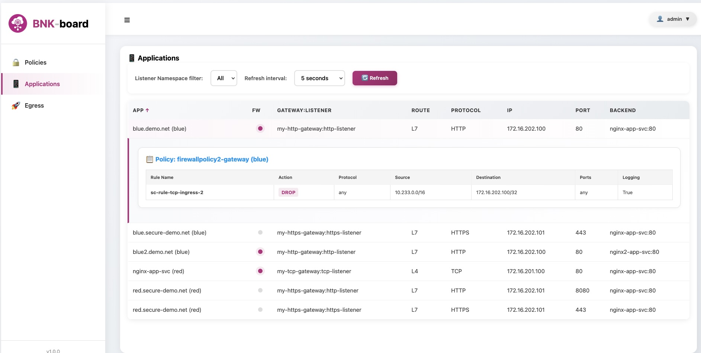
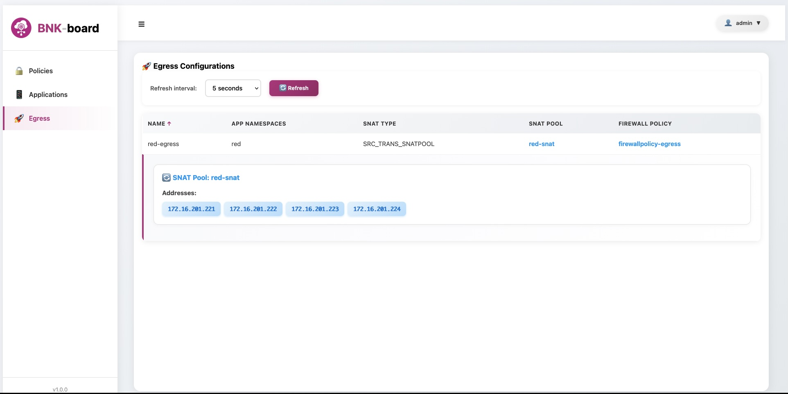

# BNK-board 🚀

<div align="center">


**A modern web-based dashboard for Kubernetes Gateway and Firewall Policy Management**

[](https://opensource.org/licenses/MIT)
[](https://www.python.org/downloads/)
[](https://fastapi.tiangolo.com/)

[Features](#features) • [Installation](#installation) • [Usage](#usage) • [API Documentation](#api-documentation) • [Contributing](#contributing)

</div>

---

## 📋 Table of Contents

- [Overview](#overview)
- [Features](#features)
- [Architecture](#architecture)
- [Prerequisites](#prerequisites)
- [Installation](#installation)
- [Configuration](#configuration)
- [Usage](#usage)
- [API Documentation](#api-documentation)
- [Development](#development)
- [Screenshots](#-screenshots)
- [Troubleshooting](#troubleshooting)
- [License](#license)

---

## 🎯 Overview

BNK-board is a comprehensive web-based GUI dashboard designed to monitor F5 BNK Gateway/Listeners, Egress and associated FW Policies. It provides an intuitive interface to show  BNK configurations, Gateway resources, and security policies without needing to interact directly with kubectl commands.

### Why BNK-board?

- **No Native GUI**: Use BNK-board to easily visualize your BNK objects
- **Simplified Management**: Show complex firewall policies and gateway configurations visually
- **Real-time Monitoring**: Auto-refresh capabilities to monitor your infrastructure in real-time
- **Unified View**: See all your ingress, egress, and security policies in one place

---

## ✨ Features

### 🔒 Firewall Policies Management
- View all F5BigFwPolicy resources with their rules
- Filter policies by type (ingress/egress/unassociated) and namespace
- Merged cell view for policies with multiple rules
- Export policies to Excel/CSV format
- Real-time policy association tracking

### 📱 Applications & Ingress Management
- Monitor Kubernetes Gateway and listeners
- Track HTTPRoute and L4Route configurations
- View backend service mappings
- Application-centric view with namespace filtering
- Expandable policy details per application

### 🚀 Egress Configuration
- Manage F5SPKEgress resources
- SNAT pool configuration and monitoring
- View egress firewall policy associations
- Track application namespace mappings

### 🎨 User Interface
- Modern, responsive design
- Auto-refresh with configurable intervals
- Sortable tables with multi-column support
- Export capabilities (CSV format)
- Collapsible sidebar navigation

### 🔐 Security
- Nothing currently :) There is a mockup of form authentication (user: admin, password: ilovebnk), but ehi, it's for demos right now.

---

## 🏗️ Architecture

```
┌─────────────────┐
│   Web Browser   │
│  (HTML/CSS/JS)  │
└────────┬────────┘
         │
         │ HTTP/REST
         │
┌────────▼────────┐
│   FastAPI       │
│   Backend       │
│   (Python)      │
└────────┬────────┘
         │
         │ kubectl
         │
┌────────▼────────┐
│   Kubernetes    │
│   API Server    │
└─────────────────┘
```

### Components

**Frontend:**
- Pure HTML5, CSS3, and Vanilla JavaScript
- No external dependencies
- Responsive design with custom styling

**Backend:**
- FastAPI framework (Python)
- PyYAML for Kubernetes resource parsing
- subprocess for kubectl command execution

**Data Sources:**
- Kubernetes Gateway API resources
- F5 Custom Resource Definitions (CRDs)
- BNK Custom Security Policies

---

## 📦 Prerequisites

- **BNK!**: Refer to (https://clouddocs.f5.com/bigip-next-for-kubernetes/2.0.0-GA/bnk-install-bnk.html)
- **Kubeconfig**: Proper K8s cluster credentials
- **docker compose**
- **Web Browser**: Modern browser (Chrome, Firefox, Safari, Edge)

### Kubernetes Resources and CRDs

BNK-board retrieve information about these resources and CRDs:

- `Gateway` (gateway.networking.k8s.io)
- `HTTPRoute` (gateway.networking.k8s.io)
- `L4Route` (gateway.k8s.f5net.com)
- `F5BigFwPolicy` (k8s.f5net.com)
- `BNKSecPolicy` (gateway.k8s.f5net.com)
- `F5SPKEgress` (k8s.f5net.com)
- `F5SPKSnatpool` (k8s.f5net.com)

---

## 🚀 Installation

### 1. Clone the Repository

```bash
git clone https://github.com/pdiliberto/bnk-board.git
cd bnkboard

Edit the docker-compose.yaml to include your .kube/config file:

volumes:
      - ~/.kube/config:/root/.kube/config:ro
      
docker compose up --build -d


### 2. Test it!

BNKboard frontend listens on port 8080

http://SERVER_IP:8080

**Default Credentials:**
- Username: `admin`
- Password: `ilovebnk`

⚠️ **Security Warning**: it's essentially a fake authentication (credentials are hardcoded in the login.html page). You can use BNK-board as it is, but just for Demos, not prod environment!


---


### Auto-refresh Intervals

Default intervals can be modified in each page's JavaScript:

```javascript
<select id="refreshInterval">
  <option value="5000">5 seconds</option>
  <option value="20000">20 seconds</option>
  <option value="60000">1 minute</option>
  <option value="manual">Manual</option>
</select>
```

---

## 📖 Usage

### Dashboard Navigation

The dashboard consists of three main sections:

#### 1. 🔒 Policies
View and manage all firewall policies:
- **Filter by Type**: Ingress, Egress, or Unassociated
- **Filter by Namespace**: Select specific namespaces
- **Export**: Download policies as CSV
- **Auto-refresh**: Configurable refresh intervals

#### 2. 📱 Applications
Monitor gateway listeners and routes:
- View all applications with their backends
- Check firewall policy status (active/inactive indicator)
- Expand rows to see detailed policy rules
- Filter by listener namespace

#### 3. 🚀 Egress
Manage egress configurations:
- View SNAT pool configurations
- Check firewall policy associations
- Click on SNAT pools or policies to see details
- Monitor application namespace mappings

### Working with Policies

**Viewing Policy Details:**
1. Navigate to the Policies page
2. Click on any policy row to expand
3. View all rules with source/destination information

**Exporting Data:**
1. Apply desired filters
2. Click "Export to Excel" button
3. CSV file will be downloaded with filtered data

**Filtering:**
- Use dropdown filters at the top of each page
- Combine multiple filters for precise results
- Filters are applied in real-time

**Sorting:**
- Click on column headers to sort
- Click again to reverse sort order
- Visual indicators show current sort column and direction

---

## 🔌 API Documentation

The backend exposes RESTful API endpoints for data retrieval.

### Base URL

```
http://SERVER_IP:8000/api
```

### Endpoints

#### Get Gateways
```http
GET /api/gateways
```

Returns all Kubernetes gateways with listeners and routes.

**Response:**
```json
{
  "gateways": [
    {
      "gatewayName": "my-gateway",
      "namespace": "my-namespace",
      "ip": "x.y.y.z",
      "listenerName": "my-listener",
      "port": 80,
      "protocol": "HTTP",
      "routes": [...]
    }
  ]
}
```

#### Get All Firewall Policies
```http
GET /api/all-firewall-policies
```

Returns all firewall policies with associations.

**Response:**
```json
{
  "policies": [
    {
      "policyName": "my-policy",
      "policyNamespace": "my-namespace",
      "type": "ingress",
      "app": "my-app",
      "rules": [...]
    }
  ]
}
```

#### Get Security Policies
```http
GET /api/security-policies
```

Returns BNKSecPolicy resources mapped to gateway listeners.

#### Get Egress Configurations
```http
GET /api/egress
```

Returns F5SPKEgress configurations.

#### Get SNAT Pools
```http
GET /api/snatpools
```

Returns F5SPKSnatpool resources with IP addresses.

#### Get Firewall Policies
```http
GET /api/firewall-policies
```

Returns all F5BigFwPolicy resources.

For complete API documentation, access `/api-docs.html` in the running application.

---

## 📸 Screenshots

### Login Page


### Firewall Policies Dashboard


### Applications View


### Egress Configuration


---

## 🐛 Troubleshooting

### Common Issues

#### "Connection refused" error
**Cause**: Backend server not running
**Solution**: 
```bash
python main.py
```

#### Empty tables/No data showing
**Cause**: kubectl not configured or insufficient permissions
**Solution**:
```bash
# Check kubectl access
kubectl get gateway -A

# Verify service account permissions
kubectl auth can-i get gateway --all-namespaces
```

#### Login page redirects immediately
**Cause**: Old session cookies
**Solution**:
- Clear browser cookies for localhost
- Use incognito/private browsing mode
- Press Ctrl+Shift+Delete and clear site data

#### "Error loading policies" message
**Cause**: Missing CRDs or API unavailable
**Solution**:
```bash
# Verify CRDs are installed
kubectl get crd | grep f5
kubectl get crd | grep gateway
```

#### Auto-refresh not working
**Cause**: JavaScript error or API endpoint failure
**Solution**:
- Open browser developer console (F12)
- Check for JavaScript errors
- Verify API endpoints are responding

---

## 📄 License

This project is licensed under the MIT License - see the [LICENSE](LICENSE) file for details.

---

## 👥 Authors & Acknowledgments

### Authors
- **Paolo Di Liberto** - [YourGitHub](https://github.com/pdiliberto)

### Acknowledgments
- F5 Networks for BNK
- Kubernetes Gateway API community
- FastAPI framework developers
- All contributors who have helped improve this project

---

## 📞 Support & Contact

- **Issues**: [GitHub Issues](https://github.com/pdiliberto/bnk-board/issues)
- **Discussions**: [GitHub Discussions](https://github.com/pdiliberto/bnk-board/discussions)


---

## 🗺️ Roadmap

### Future Versions (In my dreams..)
- [ ] Advanced analytics dashboard
- [ ] Write mode (policy creation)
- [ ] Policy simulation/dry-run mode
- [ ] Multi-cluster support
- [ ] RBAC integration
- [ ] Audit logging
- [ ] Policy templates
- [ ] Backup/restore functionality

### Version 3.x.x (In Progress)
- [x] Merged cells for policies with multiple rules
- [ ] Dark mode toggle
- [ ] (Real) Authentication
- [ ] Direct API Kubernetes access (bye bye kubectl, welcome K8s Python Client!)
- [ ] Manifest for Kubernetes installation


---

<div align="center">

**Made with ❤️ for the F5 community**

⭐ Star us on GitHub if you find this project useful!

</div>
